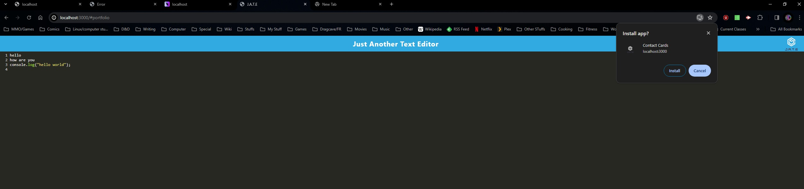
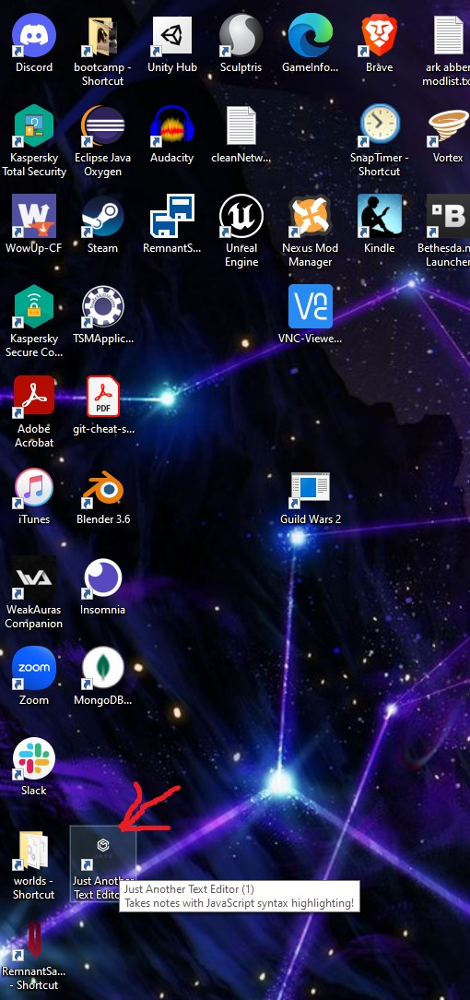

# JATE text Editor

Deployment link: https://jatetexteditor-sxxc.onrender.com/

Git Repo: https://github.com/Scrysis/TextEditor

Video link: https://youtu.be/vsKNe6-h6Eo

Hello!  Welcome to the PWA assignment, otherwise known as J.A.T.E, the text editor!

In order to use Jate, go to the deployment link and start typing!  Or tell it to install, and then start typing after clicking on the desktop link!

Special note:

The site works.  The video doesn't show any typing because I forgot to disable the script blockers when 
I transferred from localhost to the Onrender site.  And then, because I knew I was filming and was confused by it suddenly not working, I started panicking.  I only figured out that my script blocker was 
what was messing it up only after I uploaded the video.